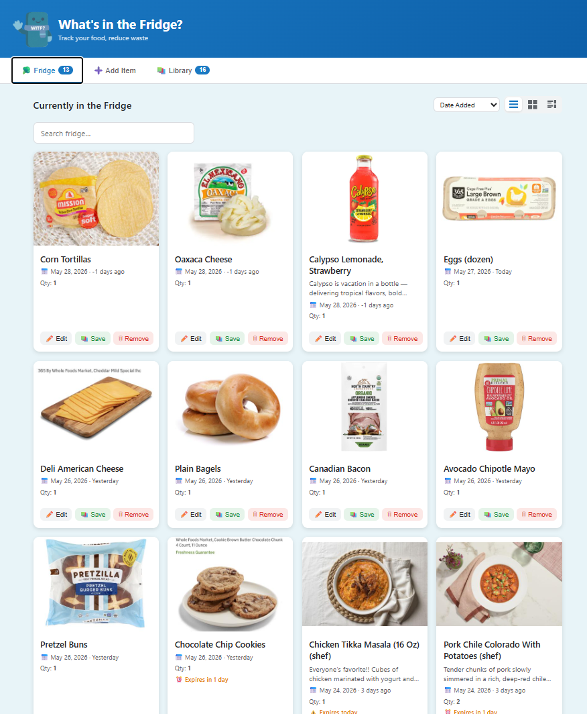
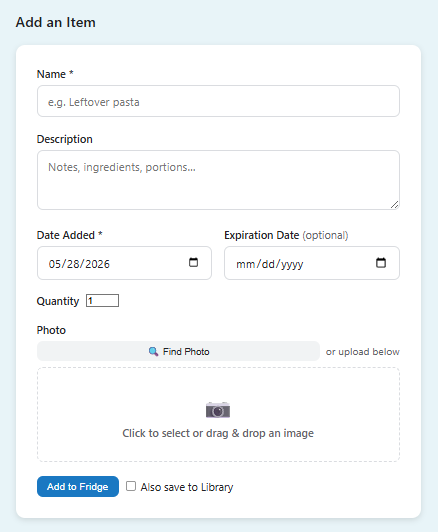
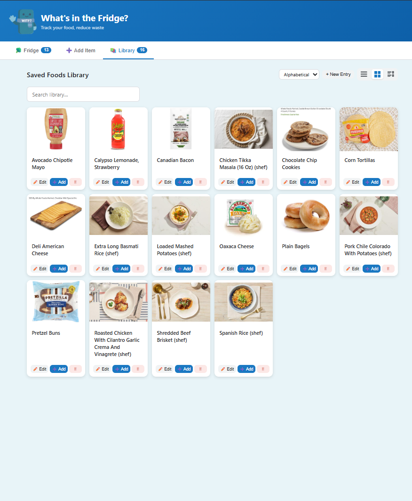

# 🧊 What's in the Fridge?

A self-hosted food tracking web app. Add items to your virtual fridge with photos, descriptions, and expiration dates — then save frequently-used items to a reusable Library so you can re-add them in one tap.

Built to run on a Raspberry Pi (or any Docker host) with no cloud dependencies.

---

## Screenshots

| Fridge | Add Item | Library |
|--------|----------|---------|
|  |  |  |

---

## Features

- **Fridge tracking** — add items with a name, description, date added, quantity, and optional expiration date
- **Photo support** — upload a photo or let the app suggest one via the Spoonacular ingredient database
- **Expiration alerts** — items expiring today or soon are highlighted automatically
- **Reusable Library** — save food templates and add them back to the fridge in one click
- **Quantity management** — increment/decrement quantities; items are soft-deleted when quantity reaches zero
- **Three view modes** — grid, list, and compact rows
- **Search & sort** — search the fridge and library, sort by date, expiration, or alphabetically
- **PWA-ready** — installable as a home screen app on iOS and Android
- **Offline-first storage** — SQLite database and uploaded images persist in a Docker volume; no external services required

---

## Stack

| Layer | Technology |
|-------|-----------|
| Backend | Python 3.11, FastAPI, SQLAlchemy |
| Database | SQLite |
| Image processing | Pillow |
| Frontend | Vanilla JS, HTML, CSS (no build step) |
| Container | Docker + Docker Compose |

---

## Requirements

- Docker and Docker Compose
- (Optional) A free [Spoonacular API key](https://spoonacular.com/food-api) for automatic photo suggestions

---

## Getting Started

### 1. Clone the repo

```bash
git clone git@github.com:youruser/WITF.git
cd WITF
```

### 2. (Optional) Set your Spoonacular API key

```bash
echo "SPOONACULAR_API_KEY=your_key_here" > .env
```

Without a key the app works fully — the "Find Photo" button simply won't return suggestions.

### 3. Build and run

```bash
docker compose up --build -d
```

The app will be available at **http://localhost:8082**.

### Useful commands

```bash
# View logs
docker compose logs -f

# Stop
docker compose down

# Stop and delete all data
docker compose down -v
```

---

## Usage

### Adding an item

1. Go to the **Add Item** tab
2. Enter a name — the app will attempt to find a matching photo automatically
3. Optionally add a description, expiration date, and quantity
4. Upload your own photo, use the suggested one, or skip it
5. Check **Also save to Library** to store it as a reusable template

### Managing the fridge

- **Edit** — update any field including the photo
- **Save** — copy the item to the Library
- **Remove** — decrements quantity by 1; the item disappears when it reaches zero

### Using the Library

- Library items are reusable templates — tap **Add to Fridge** to put one back with a single tap
- Each Library entry can have its own photo and description
- Adding from the Library increments quantity if a matching item is already in the fridge

---

## Data

All data lives inside the `witf-data` Docker volume:

| Path | Contents |
|------|----------|
| `/data/witf.db` | SQLite database |
| `/data/uploads/` | Uploaded and processed images |
| `/data/suggestion_cache.json` | Cached Spoonacular responses |

Images are automatically resized to a 400 px thumbnail on upload. The database schema is migrated automatically at startup — no manual steps needed when updating.

---

## Development

To run without Docker:

```bash
cd backend
pip install -r requirements.txt

mkdir -p ../data/uploads

# In database.py, change the DB URL to:  sqlite:///./witf.db
# In main.py, change /data/uploads → ../data/uploads
#             change /app/frontend  → ../frontend

uvicorn main:app --reload --port 8082
```

Frontend changes are hot-reloaded via a volume mount — edit any HTML/CSS/JS file and refresh the browser.

Interactive API docs are available at [http://localhost:8082/docs](http://localhost:8082/docs).

---

## License

MIT
